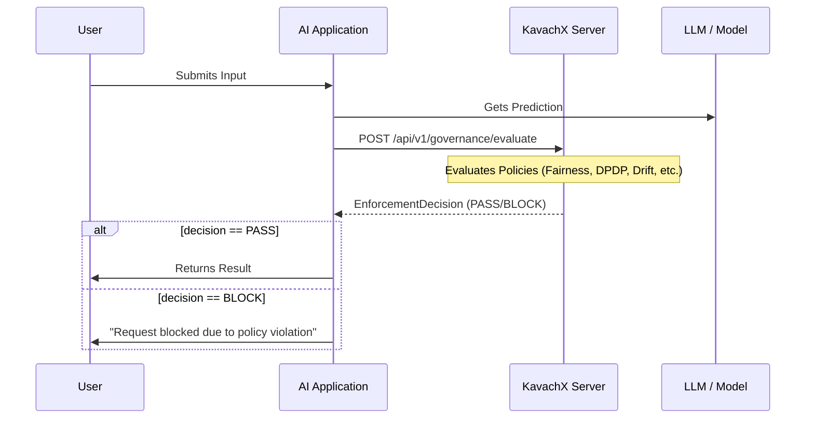

# KavachX — Real-World Integration Guide

In a production environment, you do not use the "Simulate" page. Instead, your actual AI application calls the KavachX API programmatically.

## 1. The Integration Flow

Your AI application (e.g., a Banking Bot or Credit Scoring Engine) acts as a "client" to KavachX.



## 2. API Endpoint: `/api/v1/governance/evaluate`

This is the production-equivalent of the simulation endpoint.

**Request Body Example:**
```json
{
  "model_id": "credit-bot-v1",
  "input_data": {
    "income": 50000,
    "caste_proxy_score": 0.15
  },
  "prediction": "REJECT",
  "confidence": 0.85,
  "context": {
    "domain": "credit",
    "user_id": "usr_99"
  }
}
```

## 3. Enforcement Modes

### Synchronous (Gatekeeper)
Your app **waits** for KavachX to respond. If the decision is `BLOCK` or `HUMAN_REVIEW`, you stop the transaction. This is used for high-risk applications like lending or medical advice.

### Asynchronous (Auditor)
Your app returns the model result to the user immediately, but sends the data to KavachX **in the background**. You use the "Alerts" and "Audit Logs" dashboards to catch issues after the fact.

## 4. Why Dashboards Still Work
The Dashboards do not care where the data comes from. Whether you use the "Simulate" button or a real external API call, the data is saved to the same database.
- **Production Data**: Your real-world traffic flows into the database.
- **Executive View**: Shows real-world pass rates and risk scores.
- **Audit Logs**: Records real interactions, not just test ones.
